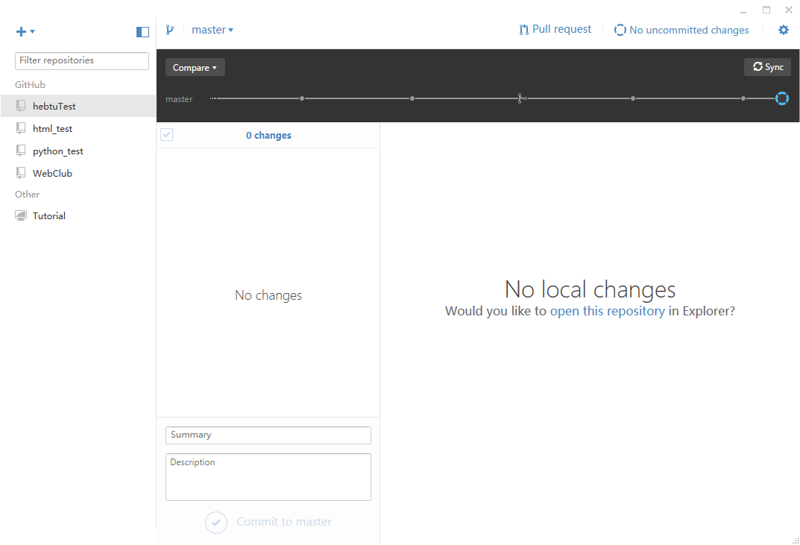

# 4.3-4.9任务
**1.GitHub深入学习与了解 难度★★☆☆☆**

统一使用此版本GitHub。

[GitHub学习教程](http://www.imooc.com/learn/390)

[GitHub简易学习文档](http://pan.baidu.com/s/1i53IQIp)

**2.初识CSS样式 难度★★☆☆☆**

[HTML+CSS](http://www.imooc.com/learn/9)（6-15章）

**3.简单样式制作 难度★★☆☆☆**

[实验一：a标签的特殊样式](test1.md)

[实验二：导航栏的制作](test2.md)

[实验三：底部版权说明的制作](test3.md)

[实验四：简单页面制作](test4.md)

# 作业
1.完成GitHub学习，与CSS初步学习。

2.在自己的sublime编辑器上安装emmet插件。

3.在github创建一个名为webclub的仓库，再在里面创建一个名为test的文件夹。

4.完成四个实验，并将四个实验文件分别放在四个名为实验1-4的文件夹中，上传到webclub的test文件夹内。