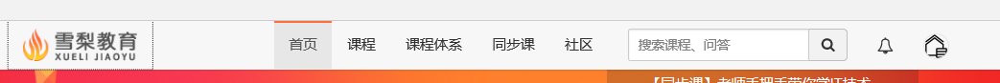
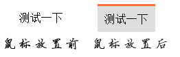

# 实验一：a标签的特殊样式

通过删除`a`标签原有样式，来定义新的样式，可以实现很多效果。如雪梨平台顶部导航栏效果。

首先，我们要用css样式，清除掉原有格式
```
a{
	text-decoration: none;//清楚格式。
	color:#000;//设置默认颜色
}
```
然后便可以用CSS样式定制成我们想要的样子。
比如：`padding:10px;`这样便可以扩大一下a标签的点击范围。（需将a标签转化为块级元素）
然后就是最常用的鼠标悬浮事件，在css中`:hover`选择器可以做到这一点（[W3C介绍](http://www.w3school.com.cn/cssref/selector_hover.asp)）
我们可以设置成以下样式
```
a:hover{
	background-color: #dedede;//设置背景色变化
	border-top: 3px solid #ff6e3d;//设置上方边框变化
}

```
这样就简单实现了雪梨平台导航按钮的样式。
完整CSS代码如下：
```
a{
	text-decoration: none;//清楚格式。
	color:#000;//设置默认颜色
	display: inline-block;//设置为行内块状元素
	padding:10px;//设置padding值为10px
}
a:hover{
	background-color: #dedede;//设置背景色变化
	border-top: 3px solid #ff6e3d;//设置上方边框变化
}
```

